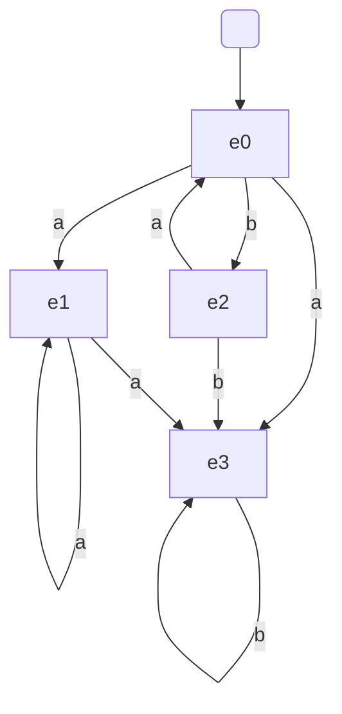

Sigma = {1, 2}

L = {todas las cadenas que se pueden formar con el alfabato}

(1 | 2)*
La barra significa "o", osea unión

Concatenación: 
- 1.2
- a.b

Exponenciación: (1.2)*
- 12
- 1212

1 o más veces: (a | b)*
- a
- b
- baa
- bbaab

(1 + 2) = cadenas con 1 o 2

Ejemplo: (01* 10* (11* 0)\*)

lema: w = B + w.gamma => w = B.gamma*

sistema de ecuaciones:
(1) w0 = epsilon + w2.a
(2) w1 = w0.a + w1.a
(3) w2 = w0.b
(4) w3 = w2.b + w0.a + w1.a + w3.b

(3) a (1): w0 = epsilon + w0.b.a
por lema:
(5) w0 = epsilon.(b.a)* = (ba)*
´
(5) a (3): w2 = (b.a)* b

(5) a (2): w1 = (ba)* a + w1.a

w1 = ((b.a)* a)a* = (ba)* a^{+}

$$(6): w1 = ((b.a)* a)a* = (ba)* a^{+}$$
significa que hay una "a" o más

(6) a (4): w3 = w2.b + w0.a + [(b.a)*.a+].a + w3.b

w3 = (b.a)* b.b + (ba)* a + [(b.a)* a+].a + w3.b

w3 = [ (ba)* bb | (ba)* a | [ (ba)* a+ ].a ].b*

Expresión Regular Final:

(ba)* b | [ (ba)* bb | (ba)* a | [ (ba)* a+ ].a ].b*

