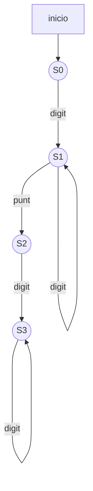
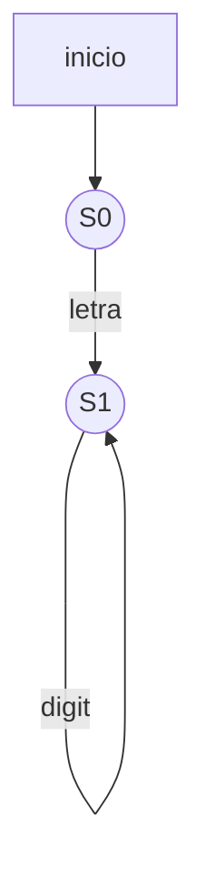

Una gramática es un conjunto de reglas para formar correctamente las frases de un lenguaje. Existen gramáticas que describen a los lenguajes naturales, por ejemplo, el idioma español, inglés, etc., y también gramáticas que describen lenguajes formales, por ejemplo los lenguajes de programación. 

En esta lección nos centraremos en el estudio de un tipo de gramáticas: las **gramáticas regulares**, las cuales se relacionan con los autómatas finitos y las expresiones regulares. Veremos que con las gramáticas regulares se puede generar el conjunto de cadenas reconocidas por autómatas finitos, o sea, a los lenguajes regulares.

# Gramática
Una gramática es un conjunto finito de reglas que describen cómo se combinan las palabras para formar oraciones o frases de un lenguaje

## Elementos
## Reglas de producción
s -> ab quiere decir que s puede substituirse con ab
(o que s se define por ab)
En lugar de -> a veces se usa ::=

## Símbolos terminales
Los que realmente aparecen en una frase o cadena
del lenguaje

## Símbolos no terminales
Pueden estar a la izquierda o a la derecha de la regla
Hay un símbolo de especial que es el de inicio

## Ejemplo
![[Pasted image 20220904172729.png]]
![[Pasted image 20220904172746.png]]

## Definición Formal
Una gramática G es una cuádrupla G = (N, T, S, P) donde
- **N** es el conjunto finito de símbolos **no terminales**
- **T** es el conjunto de símbolos **terminales**
- **S** perteneciente a N es el **símbolo inicial**
- **P** es el conjunto de **producciones**
![[Pasted image 20220904173110.png]]

## Derivación
Una gramática G genera una cadena w de terminales si, comenzando con S, se puede producir w substituyendo sucesivamente los patrones de la izquierda de alguna regla con su correspondiente lado derecho.
![[Pasted image 20220904173437.png]]

## Lenguaje
Definimos el lenguaje descrito por la gramática como el conjunto de todas las palabras de terminales que pueden derivarse a partir de S:
![[Pasted image 20220904173532.png]]

## Gramática Lineal por derecha
![[Pasted image 20220904173901.png]]

## Gramática Lineal por izquierda
![[Pasted image 20220904173914.png]]

## Gramática Regular
- Una **gramática regular** es una gramática regular por la izquierda o bien por la derecha
- Las gramáticas regulares generan lenguajes regulares

### Ejemplo
![[Pasted image 20220904174100.png]]

# Relación entre GR y AF
Para cada gramática regular G existe un autómata finito M tal que L(G) = L(M)
Las gramáticas lineales por la derecha generan lenguajes regulares

## De gramática a autómata
![[Pasted image 20220904174424.png]]
![[Pasted image 20220904174444.png]]
![[Pasted image 20220904174505.png]]

## De autómata a gramática
![[Pasted image 20220904174519.png]]
![[Pasted image 20220904174557.png]]
![[Pasted image 20220904174613.png]]

# Jerarquía de Gramáticas
![[Pasted image 20220904174704.png]]
![[Pasted image 20220904174730.png]]

# Equivalencias AF, ER, GR
![[Pasted image 20220904174810.png]]

# Ejercicios
1) Escribir GR para los lenguajes
a) Números en notación decimal. Ej: 0.98

S0 => digitoS1
S1 => digitoS1 | puntoS2
S2 => digitoS3
S3 => digitoS3 | epsilon

b) Identificadores de un lenguaje de programación

S0 => letraS1 | letra
S1 => letraS1 | digitoS1 | letra | digito

c) (01)+|(10)+

S0 => 01.S1 | 10.S2
S1 => 01 | epsilon | 01.S1
S2 => 10.S2 | 10 | epsilon

# Ejemplo ejercicio 2c
sigma = {a, b, c}
L = {cadenas con ccc antes de aa}

(a | b | c)* ( (ccc) (a | b | c)* (aa) )* 

ccc (a | b | c)* aa