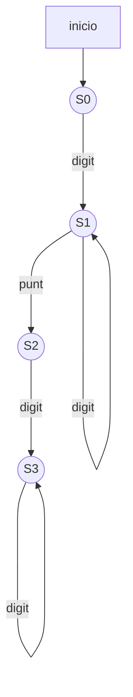
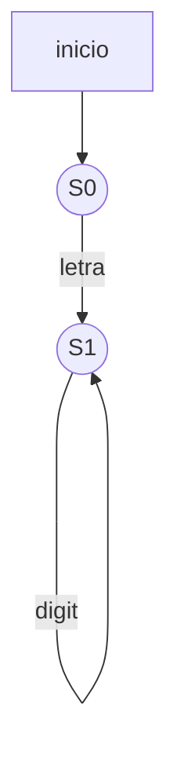

Una gramática es un conjunto de reglas para formar correctamente las frases de un lenguaje. Existen gramáticas que describen a los lenguajes naturales, por ejemplo, el idioma español, inglés, etc., y también gramáticas que describen lenguajes formales, por ejemplo los lenguajes de programación. 

En esta lección nos centraremos en el estudio de un tipo de gramáticas: las **gramáticas regulares**, las cuales se relacionan con los autómatas finitos y las expresiones regulares. Veremos que con las gramáticas regulares se puede generar el conjunto de cadenas reconocidas por autómatas finitos, o sea, a los lenguajes regulares.

# Gramática
Una gramática es un conjunto finito de reglas que describen cómo se combinan las palabras para formar oraciones o frases de un lenguaje

## Elementos

## Ejemplo

## Definición Formal

## Derivación

# Relación entre GR y AF

# Ejercicios
1) Escribir GR para los lenguajes
a) Números en notación decimal. Ej: 0.98

S0 => digitoS1
S1 => digitoS1 | puntoS2
S2 => digitoS3
S3 => digitoS3 | epsilon

b) Identificadores de un lenguaje de programación

S0 => letraS1 | letra
S1 => letraS1 | digitoS1 | letra | digito

c) (01)+|(10)+

S0 => 01.S1 | 10.S2
S1 => 01 | epsilon | 01.S1
S2 => 10.S2 | 10 | epsilon

# Ejemplo ejercicio 2c
sigma = {a, b, c}
L = {cadenas con ccc antes de aa}

(a | b | c)* ( (ccc) (a | b | c)* (aa) )* 

ccc (a | b | c)* aa