## Planificar la Gestión de la Calidad
**AC, PD, DP, FA, OPAs** // **JE, RD, TD, RepDatos, PPI, Reu** // **PGCal, MC, APD, ADP**

```mermaid
flowchart TD;
	proceso[Planificar la Gestión de la Calidad]
	subgraph Entradas
		AC
		PD
		DP
		FA
		OPAs
	end
	subgraph HyT
		JE
		RD
		TD
		RepDatos
		PPI
		Reu
	end
	subgraph Salidas
		PGCal
		MC
		APD
		ADP
	end
	proceso --> Entradas
	Entradas --> HyT
	HyT --> Salidas
```

## Gestionar la Calidad 
**PD, DP, OPAs** // **RD, TD, RepDatos, Audit, RP, MMC** // **InfCal, DPE, SC, APD, ADP**

## Controlar la Calidad
**PD, DP, SCA, E, DDT, FA, OPAs** // **RD, Ins, PEP, RepDatos, Reu** // **MCC, EV, IDT, SC, APD, ADP**

