## Planificar la Gestión de los Costos
**AC, PD, FA, OPAs** // **JE, AD, Reu**
// **PGC**

```mermaid
flowchart TD;
	proceso[Planificar la Gestión de los Costos]
	subgraph Entradas
		AC
		PD
		FA
		OPAs
	end
	subgraph HyT
		JE
		AD
		Reu
	end
	subgraph Salidas
		PGC
	end
	proceso --> Entradas
	Entradas --> HyT
	HyT --> Salidas
```

## Estimar los Costos
**PD, DP, FA, OPAs** // **JE, EstAn, EstP, EstAsc, Est3V, AD, SIDP, TD** // **EstCost, BEst, ADP**

## Determinar el Presupuesto
**PD, DP, DN, A, FA, OPAs** // **JE, CA, AD, RIH, CLF, Fi** // **LBCost, RFP, ADP**

## Controlar los Costos
**PD, DP, RFP, DDT, OPAs** // **JE, AD, IDTC, SIDP** // **IDT, PCost, SC, APD, ADP**

