# Planificar la Gestión del Cronograma
**AC, PD, FA, OPAs** // **JE, AD, Reu** // **PGC**

```mermaid
flowchart TD;
	proceso[Planificar la Gestión del Cronograma]
	subgraph Entradas
		AC
		PD
		FA
		OPAs
	end
	subgraph HyT
		JE
		AD
		Reu
	end
	subgraph Salidas
		PGC
	end
	proceso --> Entradas
	Entradas --> HyT 
	HyT --> Salidas
```

# Definir las Actividades
**PD, FA, OPAs** // **JE, Desc, PG, Reu** // **LA, AdA, LH, SC, APD**

# Secuenciar las Actividades
**PD, DP, FA, OPAs** // **MDP, DID, AyR, SIDP** // **DRC, ADP**

# Estimar la Duración de las Actividades
**PD, DP, FA, OPAs** // **JE, EstAn, EstP, Est3V, EstAsc, AD, TD, Reu** // **EstDur, BEst, ADP**

```mermaid
flowchart TD;
	proceso[Estimar la Duración de las Actividades]
	subgraph Entradas
		PD
		DP
		FA
		OPAs
	end
	subgraph HyT
		JE
		EstAn
		EstP
		Est3V
		EstAsc
		AD
		TD
		Reu
	end
	subgraph Salidas
		EstDur
		BEst
		ADP
	end
	proceso --> Entradas
	Entradas --> HyT
	HyT --> Salidas
```

# Desarrollar el Cronograma
**PD, DP, A, FA, OPAs** // **ARC, MRC, OR, AD, AyR, CC, SIDP, PAL** // **LBC, CP, DatCron, CalProy, SC, APD, ADP**

# Controlar el Cronograma
**PD, DP, DDT, OPAs** // **AD, MRC, SIDP, OR, AyR, CC** // **IDT, PC, SC, APD, ADP**

