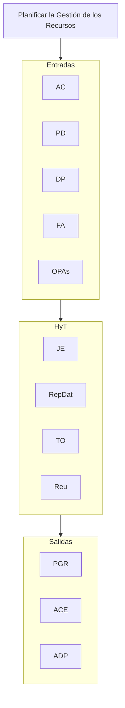
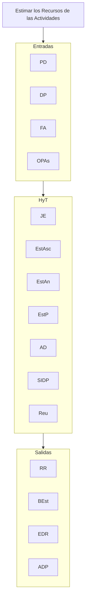

## Planificar la Gestión de los Recursos
**AC, PD, DP, FA, OPAs** // **JE, RepDat, TO, Reu** // **PGR, ACE, ADP**

## Estimar los Recursos de las Actividades
**PD, DP, FA, OPAs** // **JE, EstAsc, EstAn, EstP, AD, SIDP, Reu** // **RR, BEst, EDR, ADP**

## Adquirir Recursos
**PD, DP, FA, OPAs** // **TD, HIE, APrev, EqVirt** // **ARF, AEP, CalRec, SC, APD, ADP, AFA, AOPAs**

## Desarrollar el Equipo 
**PD, DP, FA, OPAs** // **CU, EqVirt, TecC, HIE, RyR, Cap, EIE, Reu** // **EDE, SC, APD, ADP, AFA, AOPAs**

## Dirigir al Equipo
**PD, DP, InfDT, EDE, FA, OPAs** // **HIE, SIDP** // **SC, APD, ADP, AFA**

## Controlar los Recursos
**PD, DP, DDT, A, OPAs** // **AD, RP, HIE, SIDP** // **IDT, SC, APD, ADP**

