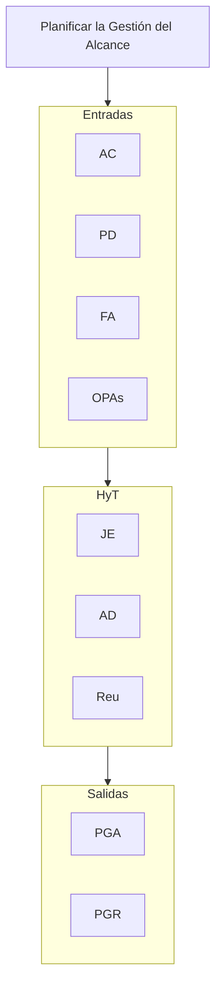
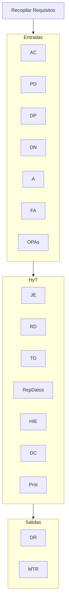
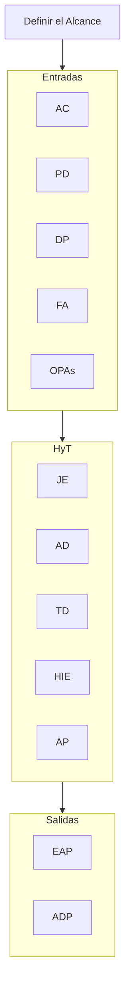
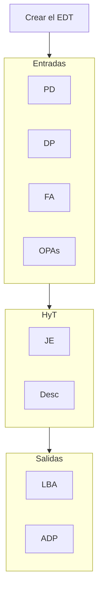
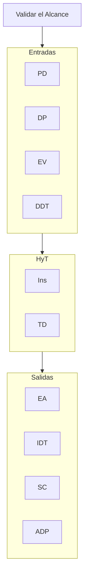
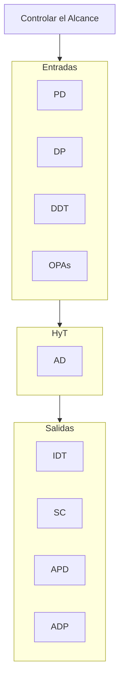

## Planificar la gestión del Alcance
**[[Conceptos#Acta de Constitución del Proyecto AC|AC]], PD, FA, OPAs** // **JE, AD, Reu** // **PGA, PGR**

## Recopilar Requisitos 
**AC, PD, DP, DN, A, FA, OPAs** // **JE, RD, TD, RepDatos, HIE, DC, Prot** // **DR, MTR**

## Definir el Alcance
**AC, PD, DP, FA, OPAs** // **JE, AD, TD, HIE, AP** // **EAP, ADP**

## Crear el EDT
**PD, DP, FA, OPAs** // **JE, Desc** // **LBA, ADP**

## Validar el Alcance
**PD, DP, EV, DDT** // **Ins, TD** // **EA, IDT, SC, ADP**

## Controlar el Alcance
**PD, DP, DDT, OPAs** // **AD** // **IDT, SC, APD, ADP**

