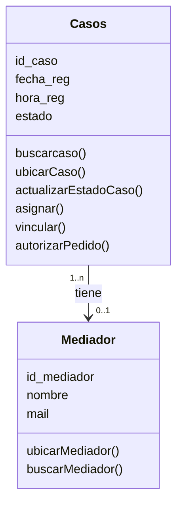

Diagrama de clases en diseño: ya hay métodos y tipos de datos

Los tipos de vínculos entre las clases son:
- Asociación: linea normal uniendo clase
- Agregación: linea finalizada con un rombito vacio. Relación entre dos clases no tan fuerte como la composición.
- Composición: linea finalizada con un rombito lleno.  Ejemplo: La linea de una orden de compra. La linea no puede existir si no existe el orden de compra.
- Especialización: linea con una flecha vacía (herencia)

Convecion: nombre de los metodos igual al nombre de los mensajes

