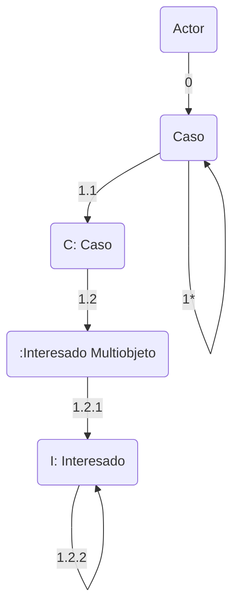

En el diagrama de clases en diseño, hay que poner los tipos de datos en las atributos.

# Generación de Informes
Primero por saber: que informe queremos generar
1. Hacemos un bosquejo del informe de salida:

------

**Informe Casos Mediación**
Período: 01/08/22 - 26/08/22

 \# Caso | Fecha | Motivo | Interesado
 -- | -- | -- | --
 348 | 02/08 | MotivoX | Pablo Sandoval
 402 | 10/08 | Educación | Ignacio Villanueva
 
 ---------

2. Empezamos con el diagrama de Colaboración

## Diccionario de datos
_d = fecha_desde + fecha_hasta_
_r = C.id_caso + C.fecha_caso + C.motivo + I.nombre_int

## Mensajes
0: genInf(d)

1*: C = buscar(fecha_desde, fecha_hasta)
1*: [fecha_desde <= fecha_act <= fecha_hasta] C=buscar()
_El * significa ciclo_

1.1: ubicar()

1.2: [para todo interesado vincullado a caso] I = buscar() 
_no hay asterisco, ya que estoy preguntado los interesados vinculados a la instancia de caso_

1.2.1: ubicar()

1.2.2: mostrar(r)

