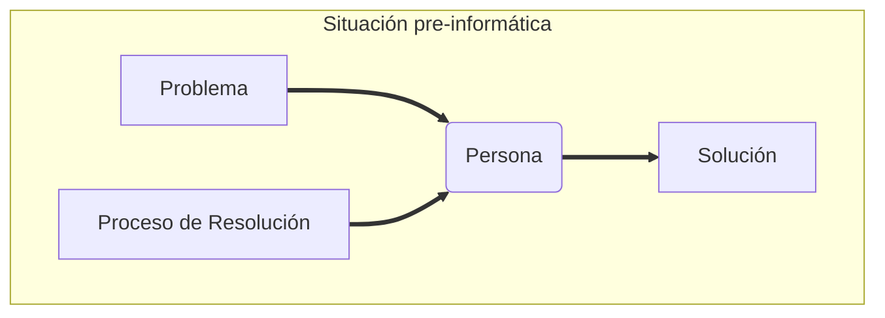

# Definición
Aplicación disciplinada de los conocimientos científicos para resolver limitaciones y requerimientos conflictivos de problemas de significación inmediata y práctica.

# Objetivo
Creación de **instrumentos** que sustituyan, o, en algún caso, imiten al ser humano en la resolución de cierto tipo de problemas.

# Características aplicables al proceso [[Software]]
La ingeniería soluciona problemas con un **uso moderado** de todos los recursos.
Soluciona problemas **aplicando ciencias** con análisis y diseño.
Soluciona problemas con procesos **repetibles y transmisibles**.

Los ingenieros de un talento común pueden aplicar sus conocimientos para resolver problemas **de una manera rápida** al compartir soluciones previas, no dependiendo de la capacidad de resolución de virtuosos.

La práctica de Ingeniería capacita a la gente común para crear sistemas sofisticados que funcionan, quizás no expectacularmente, pero sí de modo fiable.

## Fases del Proceso General de Construcción
![[Pasted image 20220529020931.png]]

