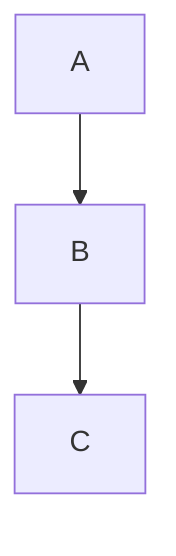

# hola




```python
print("hello world!")
def metodo:
	print("metodo")
```

- item1
- item 2

- [ ] tarea 1
- [ ] tarea 2
- [ ] tarea 3


column1 | column2
-- | -- 
fila11 | fila 12
fila21 | fila 22

