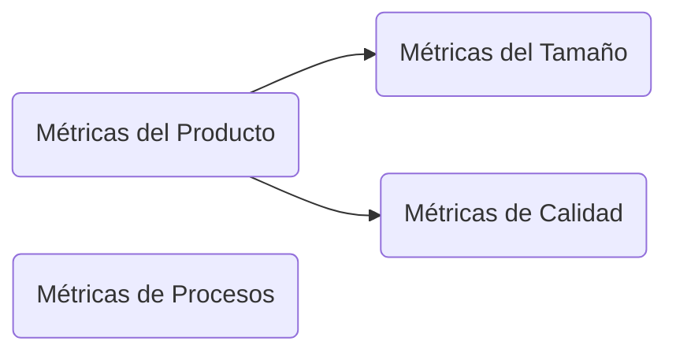

# Métricas
## Clasificación

## Del producto y del proceso
aspectos generales de las métricas

axioma gestión: lo que no se mide, no se controla

## Técnicas de Estimación
### Generales
1. Opinión de expertos
2. Analogía: inferencia en base a métricas
3. Descomposición: Estimar A, B y C, para la situacion ABC
4. Ecuaciones de estimación: 

## Modelos de Estimación
Todas fórmulas empíricas
### Estadísticos
$$Esfuerzo = 5200LDC ^ {0.91}$$
LDC = líneas de código

### Basados en teorías
$$K=\frac{L^{3}}{C^{3}T^{4}}$$
Con
L = Lineas de codigo
K = esfuerzo durante todo el ciclo de vida en años/personas
C = Constante dependiente de tecnologia, C = 200, 8000, 11000
T = tiempo de desarrollo en años

### Compuestos
Utilizan intuición, anáisis estadístico y juicio de expertos,
Ejemplos:
- Modelo COCOMO de Bohen (1981)
- Modelo COCOMO II (COnstructive COst Model) (2001)

**Hay que diferenciar estimaciones con lineas de codigo y puntos de función**

Hay que tener cuidado con las métricas basadas en líneas de código, ya que hay lenguajes de programación, y mientras mayor la generación, menos lineas para la misma funcionalidad.

## Estimación por Puntos Función
IFPUG: International Function Point Users' Group

se basa en parámetros básicos externos:
1. Entrada
2. Salida
3. Consultas
4. Grupos de Datos Lógicos Internos
5. Grupos de Datos Lógicos Externos

Una vez obtenido la cantidad de Puntos Función, se debe hacer una Valoración del Grado de Influencia de la Tecnología Software y de Entorno utilizada.

**TDI: Total Degree of Influence**

A partir de eso será posible conseguir el Factor de Ajuste obtenido en base a unas valoraciones subjetivas sobre la aplicación y su entorno:

$$AF = (0.01TDI) + 0.65$$

