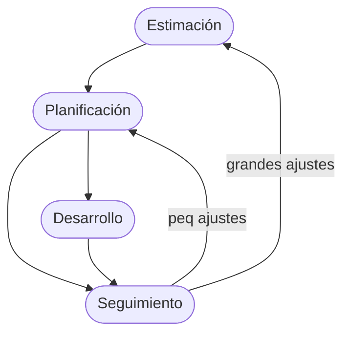
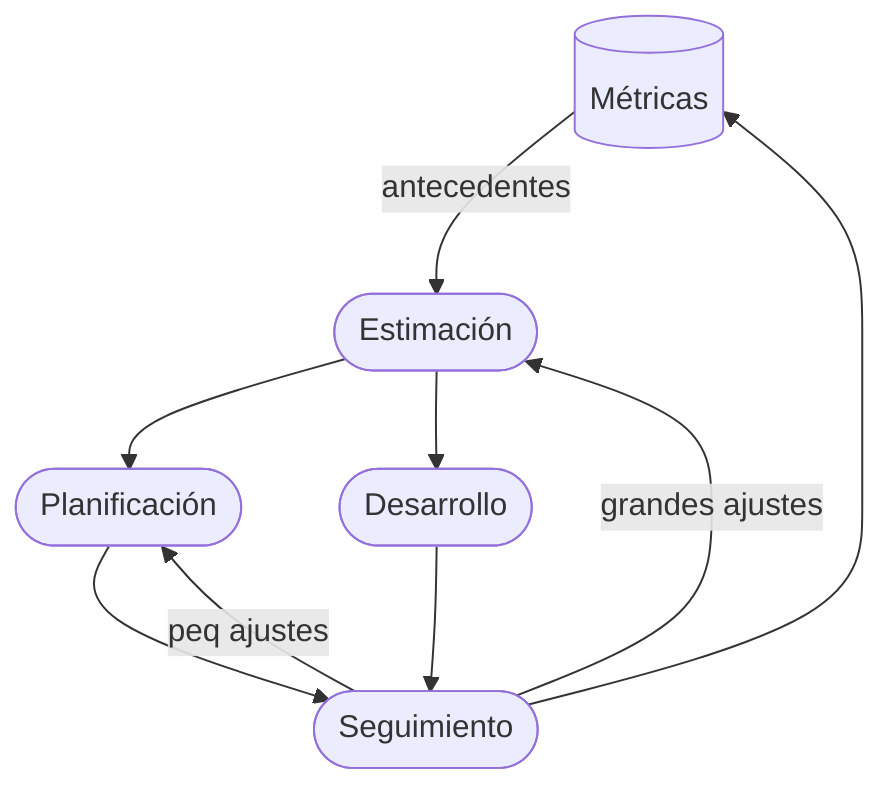

# Proyecto
## Palabras clave
- Objetivos (beneficiar a alquien, a quien quería el proyecto)
- Recursos 
	- Conectividad
	- Humanos (el recurso más sensible y complicado) (neceitamos gente con ciertos conocimientos y con capacidad para trabajar en equipo) 
	- Tecnología (H y S,)
	- Dinero
	- Conocimiento
	- Tiempo
- Equipo
- Gestión: capacidad de administrar los recursos para que un uso eficiente y que no se acaben durante el proyecto, el más dificil, subjetivo de gestionar es el recurso humano
	- Responsable del proyecto, un jefe (si es lider, mejor)
- Lider: su mejor habilidad es la de gestionar los recursos humanos, tiene que conseguir la mejor versión de cada integrante del equipo
- Factibilidad: 

Formulación -> Desarrollo -> Periodo Usabilidad P/U

# Métricas y Estimaciones
## Introducción
Los jefes del proyecto no tenian conceptos que hoy conoces sobre proyectos, entonces ya sabía que iba a ser dificil determinar tiempos y costos.

Las estimaciones se hacian solo al principio del proyecto, donde no habia tanta información 

A medida que pasa el tiempo, el hardware se vuelve menos costosos y más poderosos. Entonces se empieza a gastar más en el software que en el hardware.

Nube: infraestructura de almacenamiento virtual que no importa en donde se ubique para el que lo utiliza

Al principio el mantenimiento no era algo importante, se le da más importancia a medida que pasa el tiempo. Hoy el 30-40% de inversión es en hacer el software, el resto es mantenimiento.

### Tipos de tareas para favorecer el éxito de un proyecto
- **Estimación**: de duración, costo y esfuerzo (cant horas hombre). tratar de asignarle un valor a esas tres variables
- **Planificación**: de tareas a realizar, asignación de personas, tiempos, etc., para construir el proyecto. Armar una estrategia que nos lleve desde el inicio al fin dle proyecto por un camino previsto, armar como se usan los recursos, como se usa el tiempo, para que al final tengamos el resultado esperado
- **Seguimiento**: actividad de controlar que esta pasando entre lo que ocurre realmente con lo previsto en la planificación

la variable tiempo es la más complicada, no hay forma de ahorrar tiempo

El desarrollo tiene escondido el ciclo de vida elegido/contenido en el plan

cuando el modelo de trabajo es prescriptivo, se supone que hay muy pocos ajustes

los grandes ajusten significan perder plata, quedar mal, etc

# Métricas
## Definición
> [!quote] tip
> _es una medida que sirve para la gestión_ 

Es una medida que me ayuda gestionar correctamente el proyecto.

## Métricas útlies
- **Tiempo**: que me lleva hacer una tarea
- **Costo**: 

Se van tomando todo el tiempo durante el proyecto, a lo largo de todo el ciclo y se documentan

## Clasificación de métricas 
### Forma1
- De Producto: son mediciones sobre el software. ej: cuantas funcionalidades fueron hechas, velocidad de ejecución, transacciones diarias, cant de errores, cantidad de líneas
- De Proceso: 

### Forma2
- Objetivas
- Subjetivas: ej: calidad, experiencia de usuario

### Forma3
- Directas
- Indirectas
