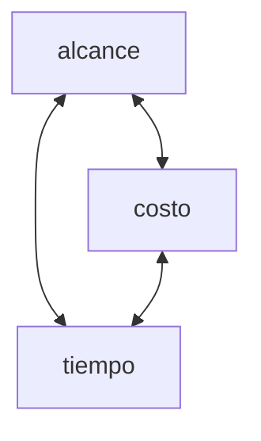

# Metodos de Planificación Temporal
Se aplican CPM y PERT.

Estos metodos no son aplicables en contextos cambiantes, para usarlos, se presupone que las especificaciones estan listas/congeladas.

en un contexto no cambiante:
**camino critico**: secuencia de pasos que se deben ejecutar en un plan en un tiempo previsto. Si se demoran, el plazo previsto ahora si se va a demorar.

El esfuerzo por mantenar vivo el software es mayor al de construir el software

la ing de sw trata que el software se construya de tal forma que el mantanimiento sea barato.

# Seguimiento y control del proyecto
el seguimiento en el desarrollo sirve para que ver que ajustes son necesarios

## control
Es clave tomar acciones correctivas

# Sistema de Control del Proyecto
Las perturbaciones tienen que ver en el alcance

En metodologias agiles solo cambia el alcance, costo y tiempo nunca cambian par aun proyecto.

