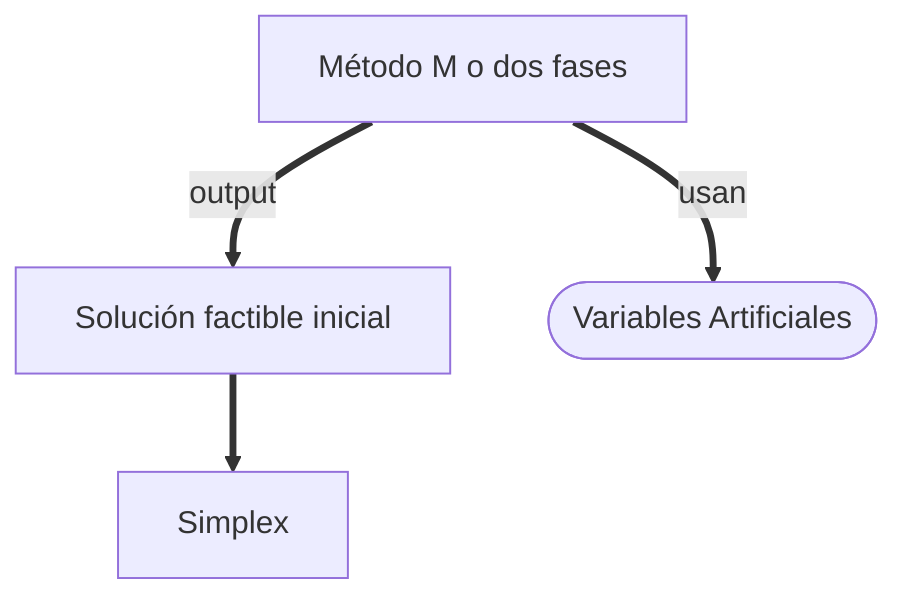

## Variables
### Físicas
- Xi originales
- Si slacks
- Sp surplus
### No físicas
- Artificiales

# Método de dos fases
Hacemos una función objetivo que minimize las variables artificiales.

$$\text{min} \hspace{0.5cm} r=R_{1}+R_{2}$$
Básica | x1 | x2 | x3 | R1 | R2 | x4 | Solución
---- | - | - | - | - | - | - | - 
r | 0 | 0 | 0 | -1 | -1 | 0 | 0
R1 | 3 | 1 | 0 | 1 | 0 | 0 | 3
R2 | 4 | 3 | -1 | 0 | 1 | 0 | 6
x4 | 1 | 2 | 0 | 0 | 0 | 1 | 4

> [!tip]
> **_xd_**
