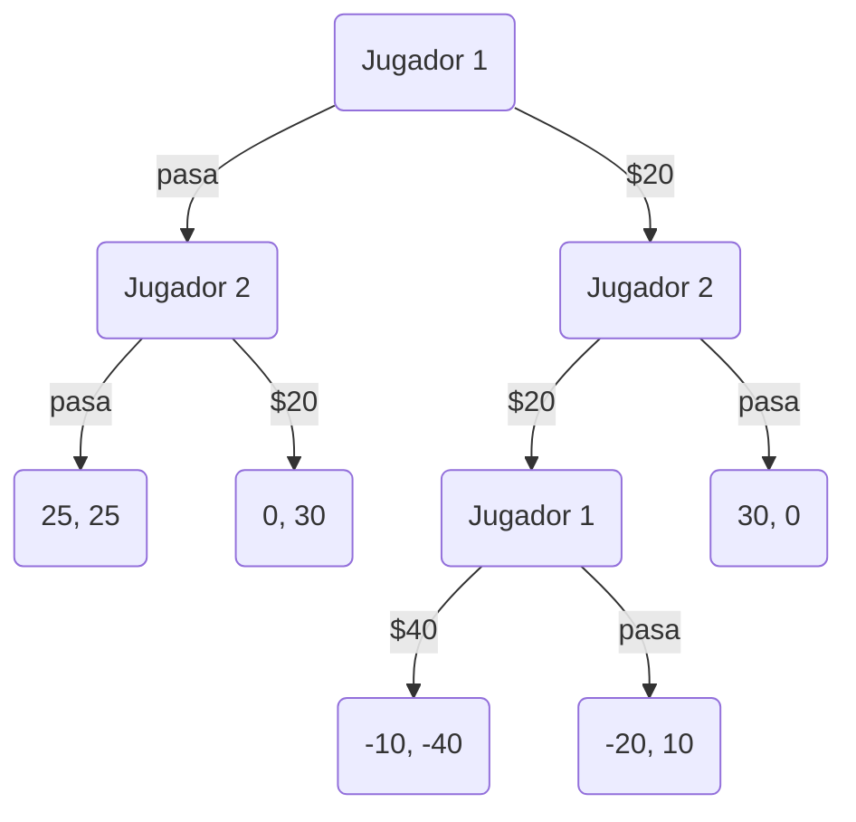
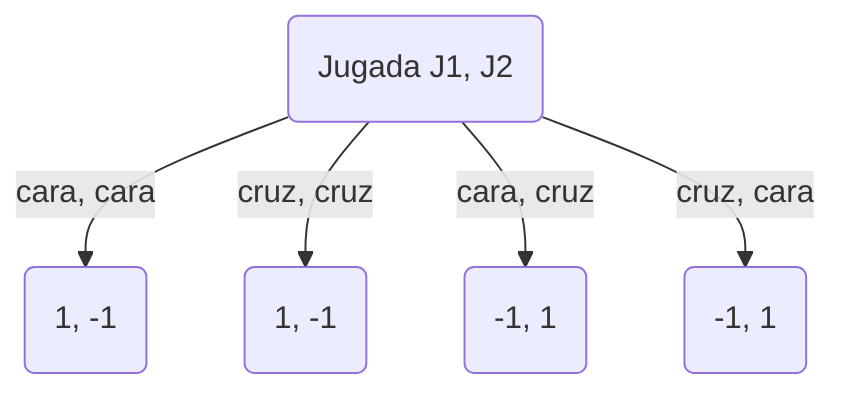
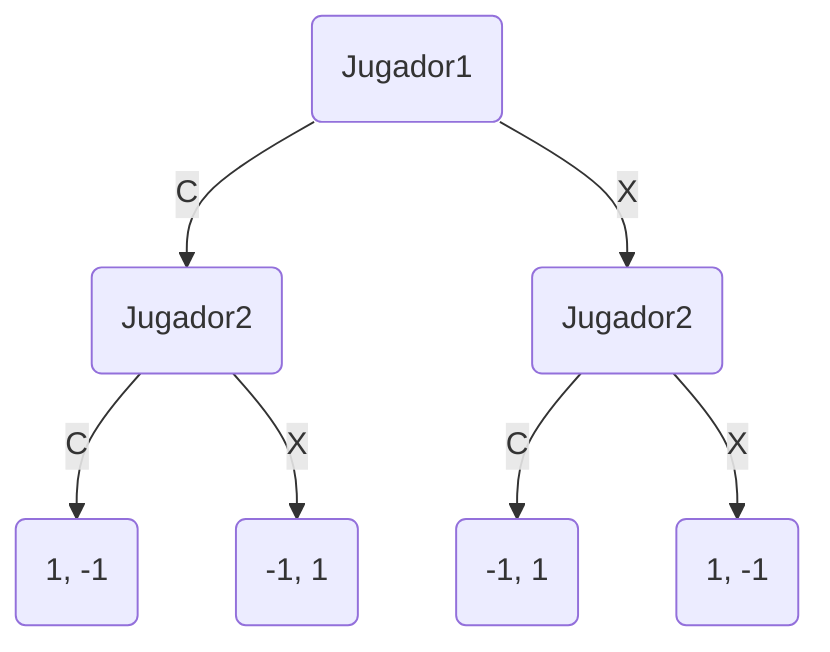

# Ejercicio Adicional 1
Pedrio subasta un billete de 50 euros entre Carlos y Blanca con las siguientes reglas: se juega por turnos. Aquel a quien le toca jugar puede pasar, o pujar con 20 euros más que el anterior (suponiendo que los tiene). Empieza Blanca (pasando o pujando con 20 euros). Si un jugador dcide pasar, ya no puede pujar en una jugada posterior. Gana el último en jugar, que se lleva el billete. Si ninguno ha pujado se llevan 25 euros cada uno. Ambos jugadores deben pagar su última puja. Aparte de las reglas es de conocimiento común que cada jugador tiene solo 60 euros.

# Ejercicio Adicional 2
Los jugadores (1 y 2) depositan de manera simultánea sendas monedas de un euro sobre una mesa.
Si resultan dos caras o dos cruces, el jugador 1 recoge los dos euros, mientras que si hay una cara y
una cruz, el jugador 2 se lleva los dos euros.

La version 1 esta mal porque cada nodo debe representar un jugador y cada flecha la estrategia por jugador.

Diagrama correcto:

# Trabajo Practico 1
## Ejercicio 1
Tabla de pagos:
Sindicato | 1,60 | 1,50 | 1,40 | 1,30 | 1,20 | 1,10
-- | -- | -- | -- | -- | -- | --
Compañia | - | - | - | - | - | -
1,10 | $1,35 | $1,50 | $1,40 | $1,30 | $1,20 | $1,10 
1,20 | $1,20 | $1,35 | $1,40 | $1,30 | $1,20 | $1,10
1,30 | $1,30 | $1,30 | $1,35 | $1,30 | $1,20 | $1,10
1,40 | $1,40 | $1,40 | $1,40 | $1,35 | $1,20 | $1,10
1,50 | $1,50 | $1,50 | $1,50 | $1,50 | $1,35 | $1,10
1,60 | $1,60 | $1,60 | $1,60 | $1,60 | $1,60 | $1,35

Tabla de suma cero (desde la vista de la compañia):
Sindicato | 1,60 | 1,50 | 1,40 | 1,30 | 1,20 | 1,10
-- | -- | -- | -- | -- | -- | --
Compañia | - | - | - | - | - | -
1,10 | -0,25 | -0,40 | -0,30 | -0,20 | -0,10 | 0 
1,20 | 0 | -0,25 | -0,40 | -0,30 | 0 | -0,10
1,30 | 0 | 0 | -0,25 | 0 | -0,20 | -0,10
1,40 | 0 | 0 | 0 | -0,25 | -0,20 | -0,10
1,50 | 0 | 0 | 0 | 0 | -0,25 | -0,10
1,60 | 0 | 0 | 0 | 0 | 0 | -0,25
